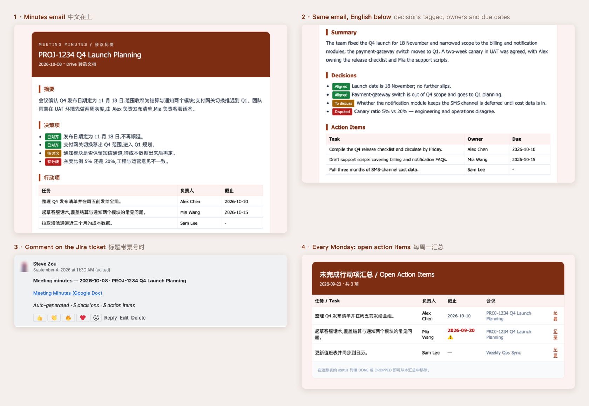

<h1 align="center">Meet Minutes AI</h1>

<p align="center">
  <b>English</b> · <a href="README.zh.md">简体中文</a>
</p>

<p align="center">
  <b>Google Meet ends. 15–45 minutes later, bilingual minutes, tagged decisions and action items are in your inbox.</b><br>
  Open items come back every Monday · Jira tickets get a link · free, runs in your own Google account
</p>

<p align="center">
  <a href="LICENSE"></a>
  
  
</p>

<p align="center">
  
</p>

<p align="center">
  Also in this repo: <a href="extras/news/README.en.md">daily bilingual market briefing</a> · <a href="extras/schedule/README.en.md">agenda mailer</a>
</p>

## What it takes off your plate

| You are | What you stop doing |
|---|---|
| Product manager | Writing up notes after the call. Every decision arrives tagged **Aligned / To discuss / Disputed / Parked**, so an open question can't pass for a settled one. |
| TPM or project lead | Chasing action items by hand. Each one lands in a tracking sheet with an owner and a due date. Every Monday you get the list of what is still open, overdue ones in red. |
| Ticket owner | Pasting links into Jira. A meeting titled `PROJ-1234 Weekly Sync` leaves a comment on PROJ-1234 pointing at the English minutes. |
| Chinese / English team | Translating for the other half of the room. The Chinese copy stays private to you; the English copy can open up to the whole project team. |
| Anyone in the call | Typing notes while trying to follow the discussion. |

## Pick your path

| You are | Recommended | What you do |
|---|---|---|
| PM, TPM, or anyone non-technical at the company | Use Steve's instance | Invite Steve and switch on Gemini notes. To get the email yourself, message Steve once. [Guide](docs/04-use-steve-instance.en.md) |
| Engineer, or a team with a lot of meetings | Run your own copy | About 30 minutes. Your own quota, your own inbox. [Setup](docs/02-self-setup.en.md) |

Steve's instance is one person's Google account. By default it has a monthly budget of about 20 hours of meetings and finishes roughly one meeting every 15 minutes. That covers the key meetings of a few project teams, not the whole company. See [capacity and limits](docs/04-use-steve-instance.en.md#capacity-and-limits).

### Company colleagues: two steps

1. Add Steve (`szou@xm.xxxx.xxx`) to the calendar invite.
2. On the same event, below the Google Meet link, switch on **Use Gemini to take meeting notes** and save. If you forgot, anyone in the call can click the Gemini notes icon at the top right, tick "Also start transcription" and start it there.

The minutes are generated after the call. Who gets the email and who can open the Doc is one line of config on Steve's side, and the [scenario table](docs/04-use-steve-instance.en.md#scenario-cheat-sheet) tells you which line you need.

## Before you rely on it

**Accuracy.** Gemini writes the minutes, and it can miss or misread things. Names and numbers in mixed-language calls suffer most. Check decisions, amounts and deadlines against the transcript before you forward anything. Every email prints the same warning.

**Data.** The transcript leaves Google Workspace and goes to the Gemini API. Make sure your team's policy allows that. On the free tier, Google may use the data to improve its models. Details in [privacy & cost](docs/06-privacy-and-cost.en.md).

**Cost.** Everything except Gemini runs inside your Google Workspace account at no extra charge. The Gemini free tier covers one person's meetings, and a monthly cap stops processing before usage runs away.

## Docs

| For | Page | What's in it |
|---|---|---|
| Everyone | [01 · What you get](docs/01-what-you-get.en.md) | The email, the two Docs, the Jira comment and the Monday digest, with screenshots |
| Colleagues using Steve's instance | [04 · Use Steve's instance](docs/04-use-steve-instance.en.md) | What you do and what Steve does, per scenario; capacity and limits |
| Everyone | [05 · Daily use & FAQ](docs/05-daily-use.en.md) | Making sure a meeting gets picked up, closing action items, why no email arrived |
| Everyone | [06 · Privacy & cost](docs/06-privacy-and-cost.en.md) | Where the data goes, who can see what, what it costs |
| Running your own copy | [02 · Set it up yourself](docs/02-self-setup.en.md) | About 30 minutes, step by step with screenshots |
| Running your own copy | [03 · Configuration reference](docs/03-config-reference.en.md) | Every switch, what it does, when to change it |
| Changing the code | [Design doc (zh)](docs/DESIGN.zh.md) · [Ops manual (zh)](docs/OPS.zh.md) | Architecture, state machine, remote operations |

## Two bundled extras

The same Apps Script project ships two unrelated scripts. They come along when you copy the project and can be deleted:

- [`extras/news/`](extras/news/README.en.md): a bilingual finance-news briefing every morning (NewsAPI + Gemini sector read)
- [`extras/schedule/`](extras/schedule/README.en.md): your daily and weekly agenda emailed to yourself

## Layout

```
MM_*.js            the meeting-minutes system (all of it)
MM_util.js         two helpers shared by all three tools
news.js            market digest (see extras/news)
schedule.js        agenda mailer (see extras/schedule)
appsscript.json    OAuth scopes and time zone, must be copied with the code
docs/              tutorials and design notes (zh / en)
scripts/mmcall.sh  remote-ops helper for whoever runs the instance
```

MIT License. Reach Steve at szou@xm.xxxx.xxx (or on the company chat), or open a GitHub Issue.
