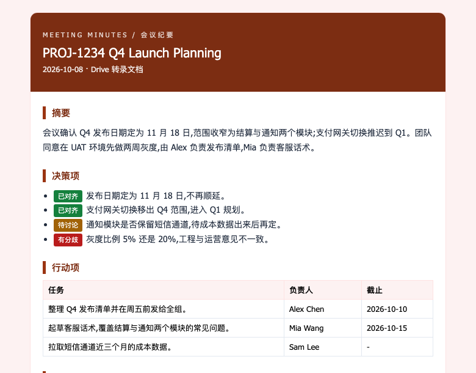
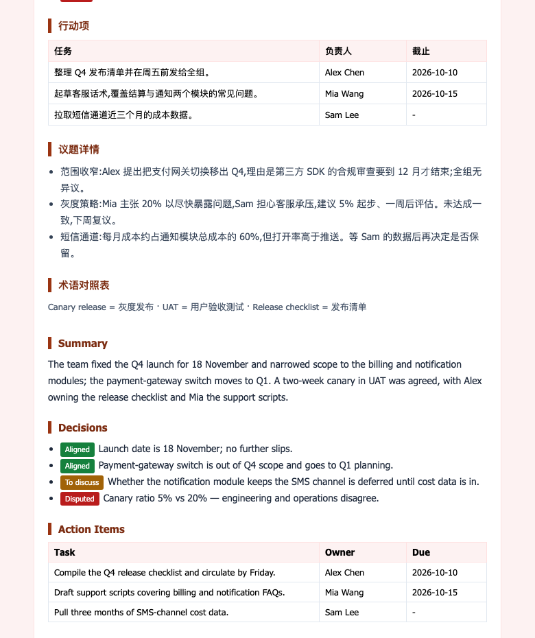
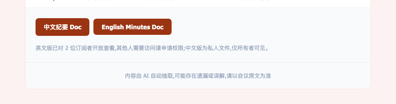
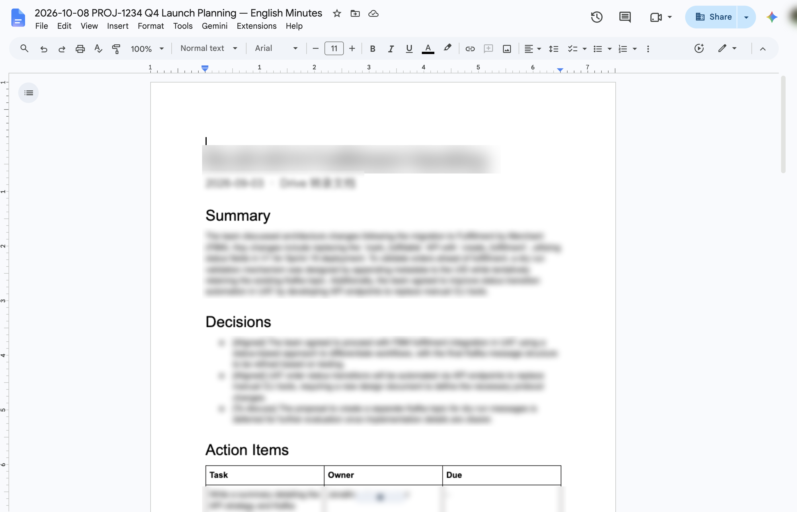
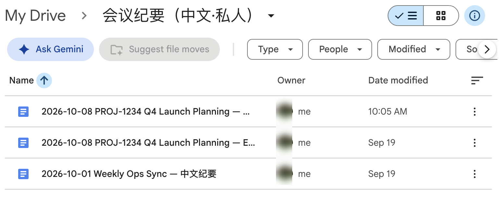
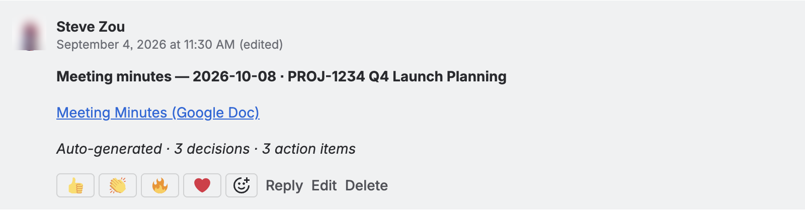
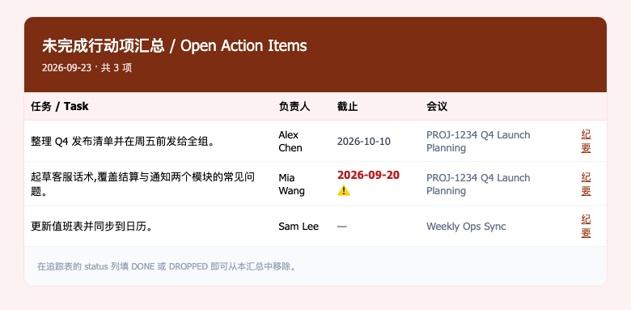

# 01 · 能得到什么

[English](01-what-you-get.en.md) · **简体中文**

> 5 分钟看完，决定要不要用。

一场留下了文字（Gemini 会议笔记或 Meet 转录）的 Google Meet 结束后，通常 15~45 分钟内，你会收到下面这些东西。

## 按角色，先看哪一节

| 你是 | 先看 | 它解决什么 |
|---|---|---|
| 产品经理（PM） | [决策标签](#决策标签四种状态) | 一眼分清哪些已经定了、哪些还悬着 |
| TPM / 项目负责人 | [周一汇总](#每周一未完成行动项汇总) · [后台表格](#一张后台表格) | 行动项跨会议追踪，不靠记忆 |
| Jira 票负责人 | [Jira 评论](#jira-评论标题里有票号时) | 纪要自动挂到票下，不用贴链接 |
| 只想看产出长什么样 | [一封邮件](#一封邮件) | 三张截图看完 |

## 一封邮件

主题：`[会议纪要] 2026-09-03 PROJ-1234 Fulfillment Handling`

从上到下：

1. 标题栏：会议名、日期、纪要来自哪种来源（Meet 转录 / Drive 文档 / 音频）
2. **中文部分**：摘要 → 决策项（每条带标签：已对齐 / 待讨论 / 有分歧 / 已搁置）→ 行动项表格（任务 · 负责人 · 截止）→ 议题详情 → 术语对照表
3. **English 部分**：同样的结构
4. 底部两个按钮：「中文纪要 Doc」「English Minutes Doc」，下面一行小字说明「谁能看到这两份文档」
5. 免责声明：内容由 AI 抽取，以会议原文为准





### 决策标签：四种状态

每条决策项由 Gemini 按会上的讨论打一个标签。拿不准的一律归「待讨论」，不会替你往「已对齐」上靠。

| 标签 | 含义 | 你可以怎么用 |
|---|---|---|
| 已对齐 | 会上明确达成一致 | 当结论引用，写进 PRD / 周报 |
| 待讨论 | 提出了，没有结论 | 放进下次会议议程 |
| 有分歧 | 有人反对，或各方意见不一 | 会后找相关人单独对齐 |
| 已搁置 | 决定先不处理 | 不用跟进，除非情况变了 |

**谁会收到？** 默认只有部署者本人。其他人要收到需要显式配置，见 [03 · 配置项](03-config-reference.zh.md#谁收邮件) 或 [04 · 找 Steve 代跑](04-use-steve-instance.zh.md)。

## 两份 Google Doc

存在你 Drive 的 `会议纪要（中文·私人）/` 文件夹里（名字可改）：

```
2026-09-03 PROJ-1234 Fulfillment Handling — 中文纪要
2026-09-03 PROJ-1234 Fulfillment Handling — English Minutes
```

- **中文版**永远只有部署者能看，系统不会共享给任何人。
- **英文版**默认也只有部署者能看；可以按项目、按人、按域打开，规则见 03。

Doc 里的结构和邮件一致，多了一个标题页信息（日期、参会人、来源）。可以直接编辑、评论、转发 —— 它就是普通 Google Doc。




## Jira 评论（标题里有票号时）

会议标题包含 `PROJ-1234` 这样的票号，纪要完成后那张票下面会多一条评论：

```
Meeting minutes — 2026-09-03 · PROJ-1234 Fulfillment Handling
📄 English Minutes (Google Doc)
3 decisions · 3 action items · 4 topics
```

纯英文、不含正文、不含中文；评论以部署者的 Atlassian 账号发出。同一场会重跑不会重复评论（会原地更新）。



## 每周一：未完成行动项汇总

每周一凌晨，如果追踪表里还有没关掉的行动项，你会收到一封汇总：

| 任务 / Task | 负责人 | 截止 | 会议 | |
|---|---|---|---|---|
| 起草一份设计文档，明确 UAT 环境的 API 端点规范 | Steve Zou | — | PROJ-1234 Fulfillment Handling | 纪要 |

已过期的截止日期会标红。把追踪表里那一行的 `status` 改成 `DONE` 或 `DROPPED`，下周就不会再出现。没有待办时不发信。



## 一张后台表格

Drive 里会多一个名为 `会议双语纪要系统 — 后台数据表` 的 Google Sheets，三个标签页：

| 标签 | 里面是什么 | 你要碰吗 |
|---|---|---|
| `Tasks` | 每场会的处理状态、错误信息、Doc 链接 | 排查问题时看，不用改 |
| `Actions` | 所有行动项，`status` 列你来维护 | **要**：完成了就填 DONE |
| `Usage` | 每月用了多少分钟 Gemini | 看看就行 |


## 它不会做什么

- 不会在会中显示字幕、不会加按钮到 Meet 界面
- 不会处理没留下文字的会（没有文字就没有纪要 —— 建会时打开「Use Gemini to take meeting notes」，或会中有人开 Gemini 笔记 / 转录）
- 不会理解视频画面；纯录音文件可以，但要 ≤ 50 MB
- 不会把纪要发给「所有同事」这种全局列表；收件人只来自这场会的参会人

下一步：[自己部署](02-self-setup.zh.md) 或 [找 Steve 代跑](04-use-steve-instance.zh.md)。
