# 02 · Set it up yourself (about 30 minutes)

**English** · [简体中文](02-self-setup.zh.md)

> No coding required. Everything happens in the browser; the only "technical" step is copy-pasting file contents.

## Before you start

| You need | Where to get it | Notes |
|---|---|---|
| Your company Google Workspace account | You have it | The script runs as you and reads your calendar and Drive |
| Meet transcription enabled | Start a test Meet, click the Gemini notes icon at the top right, and look for "Also start transcription" | Admins can disable it; then only audio files work |
| **A Gemini API key** | [Google AI Studio](https://aistudio.google.com/apikey) → Create API key | Free tier is enough for personal use. The key goes only into script properties — never share it |
| Jira API token (optional) | Atlassian account settings → Security → API tokens | Only if you want minutes posted to Jira tickets |

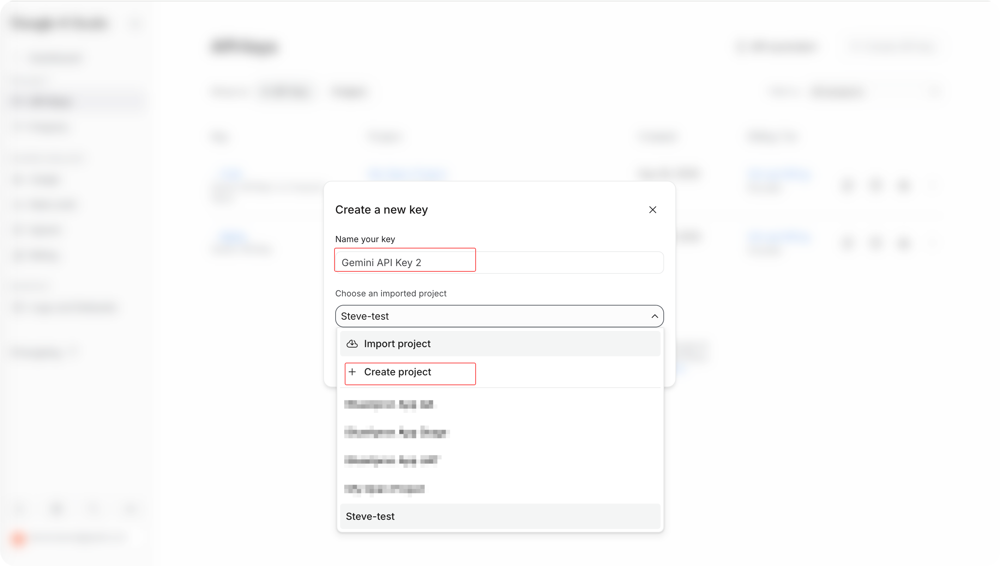
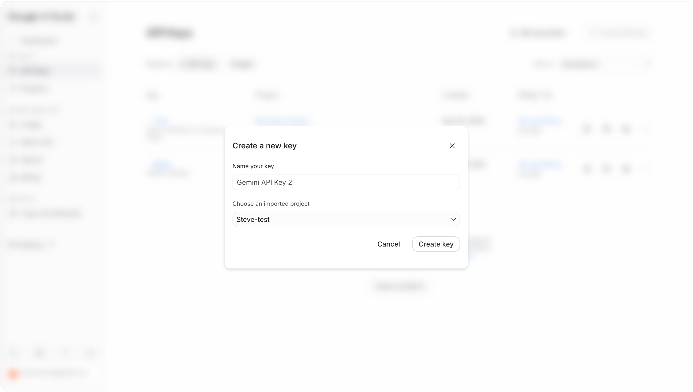
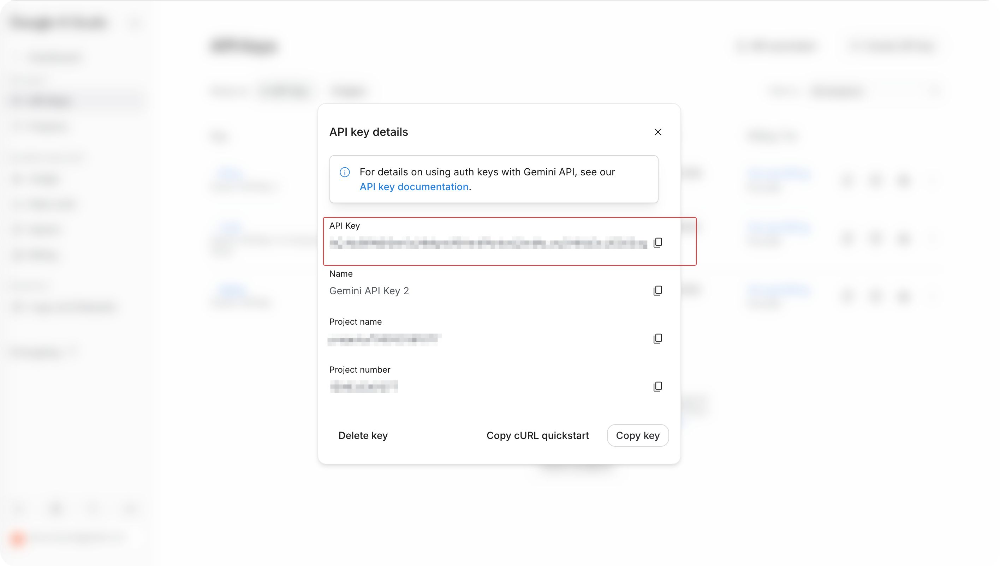

## Step 1: Create an Apps Script project

1. Open [script.google.com](https://script.google.com) → "New project" (top left).
2. Click "Untitled project" and name it, e.g. `Meet Minutes`.

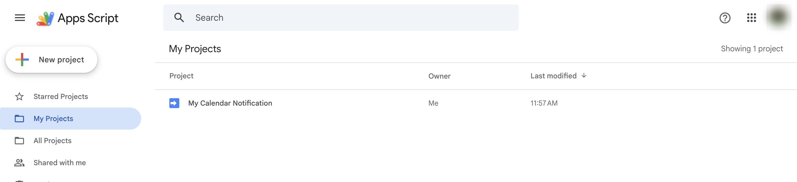

## Step 2: Make `appsscript.json` visible

Gear icon "Project Settings" → tick "Show appsscript.json manifest file in editor".

This file lists the permissions the script needs and the time zone. It **must** be replaced with the repo's version or permissions will be missing later.

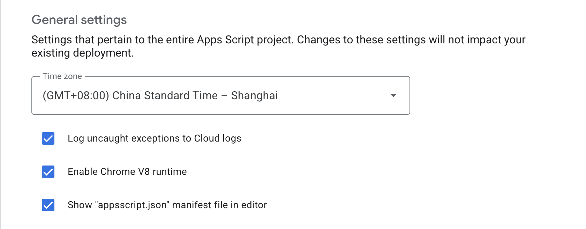

## Step 3: Paste the files in

Back in the editor. Every `.js` file in the repo root needs a file with the same name in the project:

1. Next to "Files" click `+` → "Script" → type the name without `.js`, e.g. `MM_config`.
2. Open the matching file in the repo, select all, copy, paste over the default content.
3. Repeat until you have all of these:

```
MM_ai  MM_config  MM_main  MM_members  MM_prompts  MM_remote
MM_render_doc  MM_render_jira  MM_render_mail  MM_setup
MM_source_audio  MM_source_drivedoc  MM_source_meetapi  MM_store  MM_util
```

`news` and `schedule` are the two bundled extras — add them only if you want them (see `extras/`).

4. Open `appsscript.json` and replace its whole content with the repo's `appsscript.json`.
5. Delete the default `Code.gs`.
6. `Ctrl/Cmd + S` to save everything.

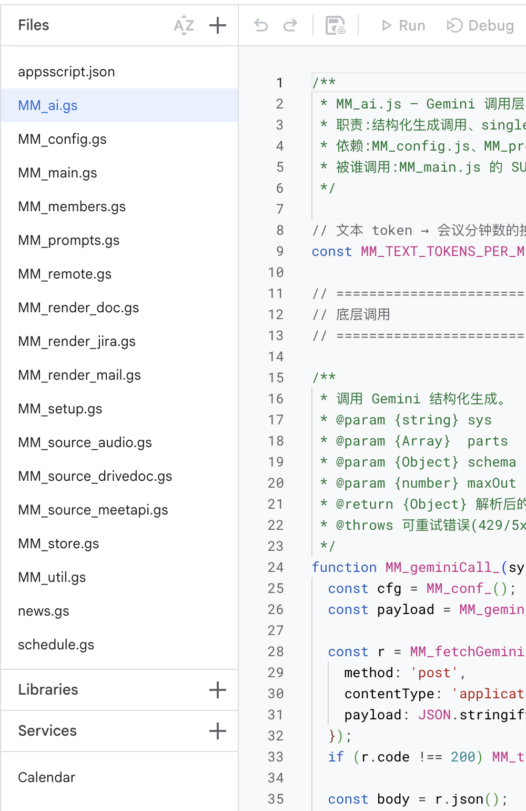

**If you are comfortable with a terminal**: install [clasp](https://github.com/google/clasp), `clasp login`, copy `.clasp.json.example` to `.clasp.json` with your script ID, then `clasp push -f`. One command, and future updates are trivial.

## Step 4: Fill in script properties

Gear "Project Settings" → bottom section "Script Properties" → "Add script property":

| Property | Value | Required |
|---|---|---|
| `GEMINI_API_KEY` | the key from step 0 | **Yes** |
| `JIRA_BASE_URL` | e.g. `https://your-company.atlassian.net` | Only for Jira comments |
| `JIRA_API_TOKEN` | Atlassian API token | Same |

Every other switch has a default. Leave them for now; see [03 · Configuration](03-config-reference.en.md) once it runs.

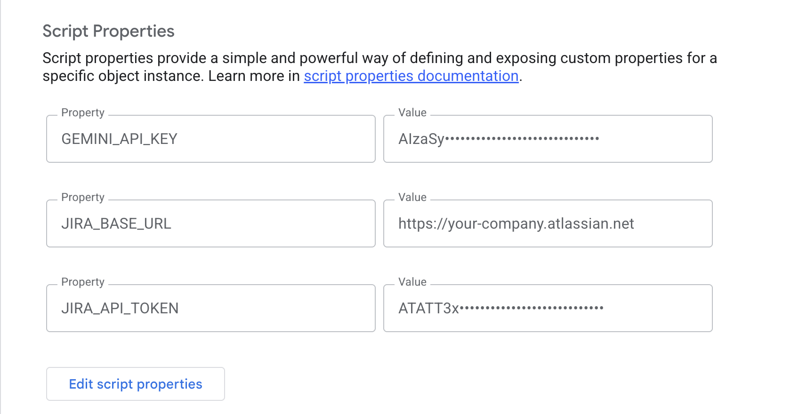

## Step 5: Authorise and run the probe

1. In the function dropdown at the top pick `MM_probe` → "Run".
2. "Authorization required" → Review permissions → choose your account.
3. On a company Workspace account you go straight to the consent screen below, which lists the permissions the script asks for: click "Continue", tick every permission, Allow. A personal Gmail account first shows "Google hasn't verified this app", which is normal for a script you wrote yourself: click "Advanced" → "Go to Meet Minutes (unsafe)" and carry on.
4. After 10–20 s the "Execution log" shows a report, and an email `[MM_probe] 会议纪要系统权限探针报告` arrives.

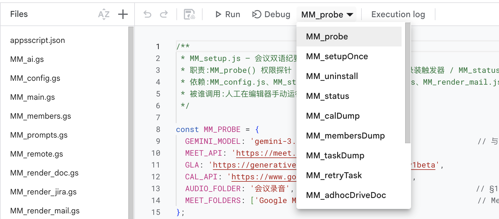
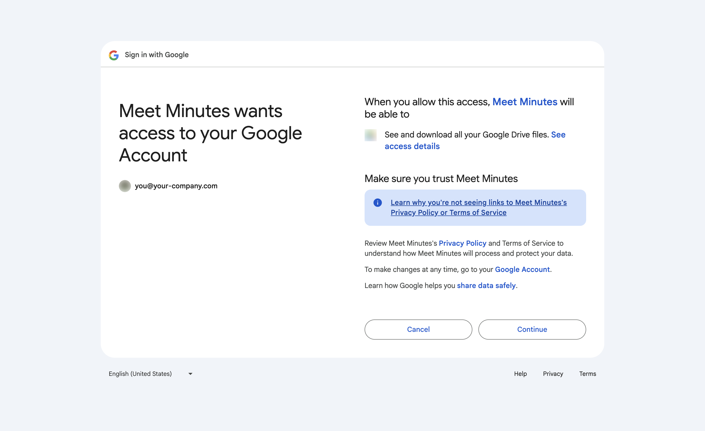
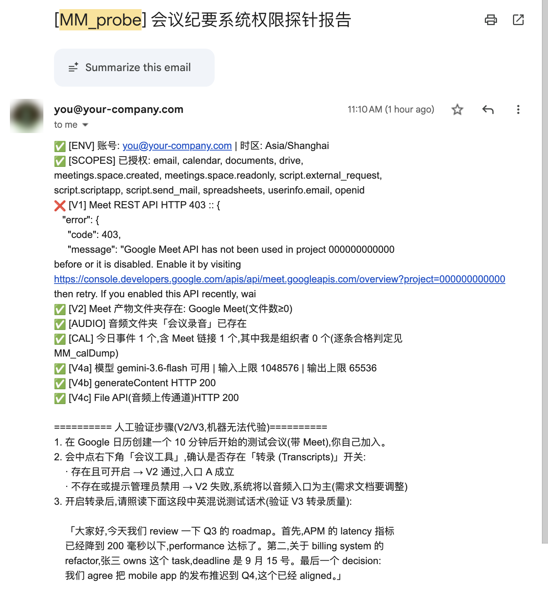

Reading the report:

| Line | Expect | If not |
|---|---|---|
| `[CAL]` | ✅ | ❌ usually means not all permissions were ticked: run `MM_authCheck`, follow its instructions to revoke at myaccount.google.com and re-authorise |
| `[V4a]` `[V4b]` | ✅ | ❌ wrong key or stale model name; the report lists available models |
| `[V1]` | often ❌ 403 | **Normal.** The Meet API is unavailable on most company accounts; the system falls back to the transcript doc in Drive |
| `[V2]` | ⚠️ no Google Meet folder | Normal — you have not had a transcribed meeting yet. Do step 6 |

## Step 6: Hold a test meeting

1. Create a calendar event starting in 10 minutes with a Meet link; invite just yourself (or one colleague).
2. In the call: the Gemini notes icon at the top right of the call → tick "Also start transcription" → "Start taking notes".
3. Talk for a minute or two — mixing Chinese and English is a good test; the probe email ends with a sample script.
4. End the meeting. Within 10–30 minutes a `Google Meet/` folder with a transcript Doc appears in Drive.


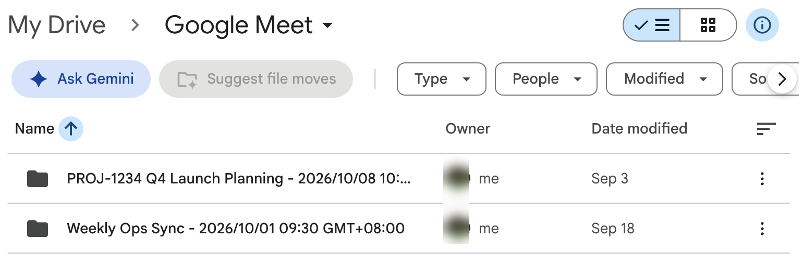

If you want a transcript without Gemini notes, the other entry is "Meeting tools" → "Transcribe" at the bottom right. If you can find neither, your admin has probably disabled it. The system still works, but you must drop a recording (≤ 50 MB) into the `会议录音/` Drive folder instead.

## Step 7: Initialise

Function dropdown → `MM_setupOnce` → Run. It will:

- create the backend spreadsheet `会议双语纪要系统 — 后台数据表` in Drive
- create the `会议录音/` folder (with `已处理/` and `纪要/`)
- install two timers: daily at 00:30 to schedule the next 24 h of meetings, and every 15 min to move things forward
- email you `[会议纪要系统] 初始化完成`

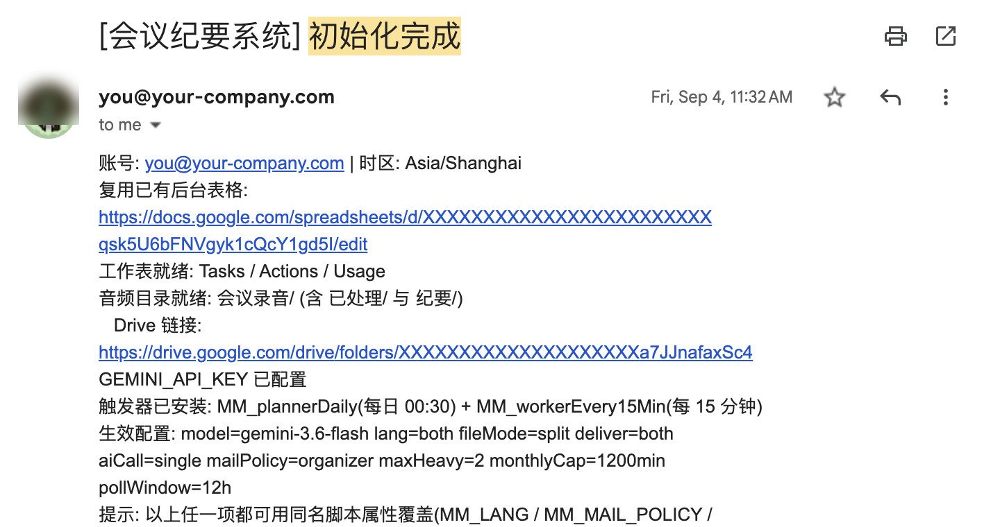

## Step 8: Confirm it is alive

Run `MM_status`; the execution log should show:

```
任务总数: 0
触发器: MM_workerEvery15Min, MM_plannerDaily
生效配置: scope=accepted lang=both fileMode=split docShare=owner ...
收件人: mailPolicy=organizer toOrganizer=off subscribers=0
```

Then run `MM_calDump` to list the next 24 h of calendar events with an eligible / not-eligible verdict and reason for each.

## From now on, two things per meeting

1. **Accept the invite** (click "Yes" in Calendar — by default only meetings you organise or have accepted are processed)
2. **Make sure there is text**: turn on "Use Gemini to take meeting notes" when creating the event (recommended), or the Gemini notes icon at the top right of the call → tick "Also start transcription" → "Start taking notes" during the call

Minutes arrive 15–45 minutes after the meeting ends. If they do not, see [05 · FAQ](05-daily-use.en.md).

## Want others to receive it too?

Default is you only. Three switches, all script properties:

| Goal | Add |
|---|---|
| A few colleagues get the email + English Doc whenever they attend | `MM_SUBSCRIBERS` = `a@company.com,b@company.com` |
| Organisers of other people's meetings get the email | `MM_MAIL_TO_ORGANIZER` = `on` |
| Whole project team can open the English Doc for that project's meetings | `MM_PROJECT_SHARE`, see 03 |

Property changes take effect at the next meeting — no redeploy needed.
