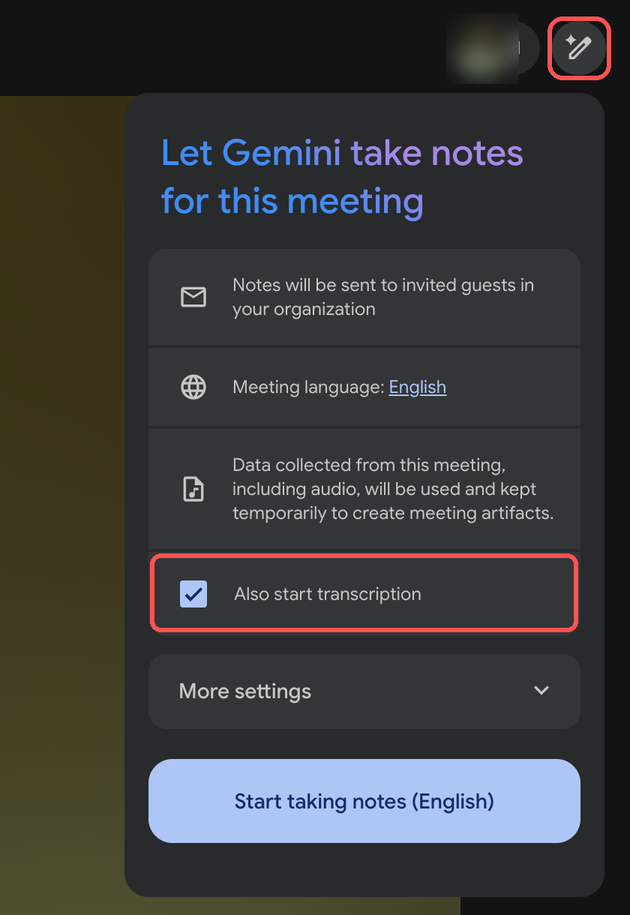

# 04 · 不想自己配？找 Steve 代跑

[English](04-use-steve-instance.en.md) · **简体中文**

> 适合「只想收到纪要、不想碰 Apps Script」的同事。

## 先说清楚一个限制

Steve 跑着一份这个系统。它**只能看 Steve 自己的日历和 Drive**。所以能被处理的会议必须同时满足：

1. **Steve（`szou@xm.xxxx.xxx`）在受邀名单里**，并且接受了邀请（日历上「是」）；
2. **会议留下了文字**：建会时打开「Use Gemini to take meeting notes」开关（推荐，一次设置每次生效），或会中有人点会中右上角的 Gemini 笔记图标 → 勾上「Also start transcription」→「Start taking notes」。没有文字就没有纪要，这一步谁都替不了。

只要满足这两条，会议结束后 15~45 分钟系统就会处理。剩下的问题只是：**产出发给谁、谁能打开**。下面按场景说。




## 场景速查

| 你的情况 | 你要做的 | Steve 要做的 |
|---|---|---|
| **S1** 项目组的会（标题带票号 `PROJ-1234`，或含项目名） | 邀请 Steve；开 Gemini 笔记 | 项目已配好就什么都不用做；新项目加一条规则 |
| **S2** 普通工作会，只想**自己**收到 | 邀请 Steve；开 Gemini 笔记；告诉 Steve 你的邮箱 | 把你加进订阅名单（一次性） |
| **S3** 你是组织者，希望**每次**都自动收到 | 同 S2 | 同 S2（订阅名单对组织者同样生效） |
| **S4** 希望**全部参会人**都收到 | 邀请 Steve；开 Gemini 笔记；把要收的人名单给 Steve | 把这些人加进订阅名单。不会开「全员群发」 |
| **S5** 历史会议 / Steve 没参加，但你有转录 Doc | 把转录 Doc 共享给 Steve（可查看即可），告诉他标题和日期 | 手工跑一次 |
| **S6** 不是 Meet，是一段录音 | 把录音（≤ 50 MB）共享给 Steve | 放进录音文件夹，15 分钟内自动处理 |
| **S7** 只要 Jira 评论，不要邮件 | 标题带票号；邀请 Steve；开 Gemini 笔记 | 无需配置 |
| **S8** 纪要里的行动项我做完了 | 告诉 Steve 哪一条 | 改追踪表状态，下周一不再提醒 |

## 逐个说明

### S1 · 项目组会议

标题里有票号（如 `PROJ-1234 Weekly Sync`）或项目关键词的会，系统会认成「该项目的会」：

- 英文纪要 Doc 自动对**项目组成员**开放（名单 = Jira 上该项目最近 4 个月有 assignee / reporter 记录的人），不看你有没有参会；
- 票号对应的 Jira 票下面多一条评论，带英文 Doc 链接；
- 邮件默认还是只发 Steve —— 要邮件请叠加 S2。

**已配好的项目**：问 Steve。**新项目**：把项目 key 和常用关键词告诉 Steve，他加一条规则即可。

### S2 / S3 · 我想收到自己参加的会的纪要

Steve 把你的邮箱加进 `MM_SUBSCRIBERS`。之后：

- 你参加（在参会人列表里）且 Steve 也在的会 → 你收到邮件，英文 Doc 对你可见；
- 你没参加的会 → 与你无关，不会收到。

一次配置永久有效，不用每场会报名。

### S4 · 全体参会人都要

系统**没有**「给所有参会人群发」的按钮 —— 有，但 Steve 不会开：那会把每一场会的纪要发给每一个人，包括不该收到的人。替代做法就是 S2：把需要的人都加进订阅名单。名单可以随时增减。

### S5 · 历史会议 / 有转录但 Steve 不在场

Meet 的转录 Doc 在组织者的 Drive 里。把它「共享给 Steve → 查看者」，然后把**会议标题**和**开会日期**发给他。Steve 手工跑一次，产出按 S1 / S2 的规则共享，或直接手动分享给你。

### S6 · 录音文件

任何格式的音频（m4a / mp3 / wav…）都可以，单个 ≤ 50 MB。视频不行，需要先转成音频：

```bash
ffmpeg -i meeting.mp4 -vn -ac 1 -ar 16000 -c:a aac -b:a 32k meeting.m4a
```

共享给 Steve 后，他放进 `会议录音/` 文件夹，15 分钟内自动处理。文件名会成为会议标题。

### S7 · 只要 Jira 评论

不用额外配置：标题带票号 + Steve 在场 + 会议留下了文字，评论就会出现。评论以 Steve 的 Atlassian 账号发出。

### S8 · 关掉行动项

纪要邮件和周一汇总里的行动项来自一张追踪表。做完了，告诉 Steve「哪场会的哪条」，他把状态改成 DONE。或者，Steve 可以把追踪表共享给你，你自己改 `Actions` 标签页的 `status` 列（填 `DONE` 或 `DROPPED`）。

## 容量与边界

Steve 的实例跑在他一个人的 Google 账号上。下面几条决定了它能接多少会：

| 限制 | 数值 | 意味着什么 |
|---|---|---|
| 月度额度 | 每月 1200「分钟」，1 小时会议约占 50~70 | 默认每月约 20 小时会议；用满当月暂停，下月 1 日自动恢复。Steve 可以调高，但下面几行调不掉 |
| 处理速度 | 每 15 分钟一轮，每轮最多 2 个耗时步骤，一场会要 2 步 | 大约每 15 分钟处理完 1 场。会议扎堆在下午结束时要排队，纪要可能晚几个小时 |
| Gemini Key | Steve 个人的 Key | 全公司的会议内容走一个人的 Key 不合适，见 [06 · 隐私与成本](06-privacy-and-cost.zh.md) |
| 邮件配额 | Workspace 每天 1500 个收件人 | 按人头算，不按封数 |
| 单点 | Steve 必须被邀请并接受；Jira 评论以 Steve 的身份发出；中文 Doc 只有 Steve 能看 | Steve 休假、账号授权过期，整个实例就停 |

几个项目组的关键会议（周会、评审、上线对齐），Steve 的实例接得住。会多的团队，或者你本身是技术人员，请 [自己部署一份](02-self-setup.zh.md)：额度和数据都在你自己的账号里。要覆盖全公司，应该由公司账号部署并配公司批准的付费 Key，不适合挂在任何一个人名下。

## 联系 Steve 的模板

复制一段，填完发到 szou@xm.xxxx.xxx 或公司 IM：

```
会议纪要请求
- 会议标题:
- 日期时间:
- 我的情况: S1 / S2 / S4 / S5 / S6(选一个)
- 希望收到邮件的人:
- 需要 Jira 评论吗: 是 / 否 (票号: )
- 其他说明:
```

Steve 这边每个场景具体改哪条配置，见 [运维手册 · 按场景的配置动作](OPS.zh.md#11-按场景的配置动作s1s8)。
