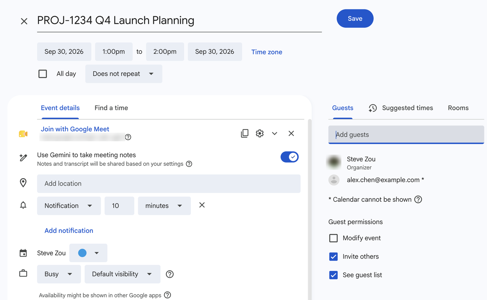
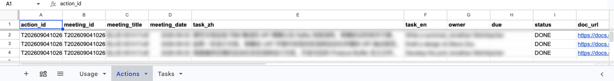

# 05 · Daily use & FAQ

**English** · [简体中文](05-daily-use.zh.md)

## Two actions per meeting

1. **Accept the invite in Calendar.** By default only meetings you organise or answered "Yes" to are processed. "Maybe" and no-reply are skipped (set `MM_EVENT_SCOPE` to `all` if you want them).
2. **Make sure the meeting leaves text behind**, either way works:
   - **Switch it on when creating the event** (recommended: nothing to remember later): in Calendar, after adding Google Meet to the event, a "Use Gemini to take meeting notes" toggle appears underneath; turn it on and save. Gemini then takes notes every time, and the notes Doc lands in `Google Meet/` where the system reads it.
   - **Start it during the call**: The Gemini notes icon at the top right of the call → tick "Also start transcription" → "Start taking notes". Any attendee can do it, not necessarily you.

   

Nothing else. After the meeting:

| When | What happens |
|---|---|
| 10–30 min after end | Google drops the transcript Doc into the organiser's Drive `Google Meet/`; attendees get a shortcut |
| Every 15 min | The system spots the transcript → calls Gemini → builds Docs → writes action items → Jira comment → sends email, one step per run |
| Typically 15–45 min | Email arrives |
| Up to 12 h | Still no transcript → marked EXPIRED, one alert to the deployer |

## Action items: how to close one

Action items from the minutes are written to the `Actions` tab of the backend sheet; open ones are summarised every Monday.

**To close one**: open the sheet (`会议双语纪要系统 — 后台数据表`) → `Actions` → find the row → change `status` from `OPEN` to:

- `DONE` — finished
- `DROPPED` — not doing it

You can also put a date in `due` (format `2026-10-01`); the Monday digest then reminds you when it is within 7 days or overdue, instead of "open for more than two weeks".

**Rule**: only rows whose `status` is exactly `OPEN` (case-insensitive) appear in the digest. Re-running the same meeting **never** overwrites a status you changed. No open items, no Monday email.

Colleagues on Steve's instance: tell Steve which item, or ask him to share the sheet with you.

## FAQ

### No email arrived

Start with what you can check yourself; most cases stop at the first three:

| # | Check | How |
|---|---|---|
| 1 | **Did the meeting leave text behind?** | Look in the organiser's Drive `Google Meet/` for a Gemini notes or transcript Doc. None = neither was on; nothing can be done |
| 2 | **Is the invite answered "Yes"?** | Own copy: you answered "Yes", not "Maybe". Steve's instance: Steve is on the invite and accepted |
| 3 | **Does the event have a Meet link?** | Zoom / Teams / phone meetings are not processed |
| 4 | **Too early** | The transcript itself takes 10–30 min; then one step per 15 min. Do not worry within the first hour |
| 5 | **Are you a recipient?** (Steve's instance) | By default only Steve gets the email. To get it yourself, Steve adds you to the subscriber list; see [04 · S2](04-use-steve-instance.en.md#s2--s3--i-want-minutes-for-meetings-i-attend) |
| 6 | **Spam folder** | Search the subject `[会议纪要]`. The sender is whoever deployed it: you for your own copy, Steve for his |

If all of that looks fine, it is the deployer's turn (you, for your own copy; for Steve's instance, send him the meeting title and date):

| # | Check | How |
|---|---|---|
| 7 | **Is the meeting in scope?** | Run `MM_calDump` and read `eligible` / `reasons` |
| 8 | **Monthly cap hit** | `MM_status` shows "本月用量" (usage this month); over 1200 minutes processing pauses for the month and the deployer gets an alert |
| 9 | **The task failed** | Find the meeting in the `Tasks` sheet: `status` and `last_error`. Common `FAILED` causes: expired Gemini key, retired model name. Fix, then `MM_retryTask` |

### Email arrived but content is off

- **Only one language**: the other failed and the system fell back to monolingual; a yellow note at the top of the email says so. Re-running usually fixes it.
- **Empty owner on action items**: the transcript did not make it clear. If the transcript has no speaker labels (e.g. Gemini notes only) the AI can only guess.
- **Wrong terminology**: it is AI extraction; the recording is the source of truth. The disclaimer at the bottom is there for a reason.

### Meetings organised by someone else

Default scope is "mine + accepted". For someone else's meeting just click "Yes" in Calendar. If `MM_calDump` says "不在范围" (out of scope) in `reasons`, check `MM_EVENT_SCOPE`.

### Recurring meetings

Every occurrence is its own task and needs transcription each time. Rescheduling is followed automatically; cancelled occurrences are skipped silently.

### The meeting moved

The system re-checks Calendar every 15 minutes and follows the new time. Nothing to do.

### The transcript is in English. Will there be Chinese minutes?

Yes. Transcript language does not matter; output always follows `MM_LANG` (default both).

### How good is transcription for mixed Chinese/English?

Meet's mixed-language recognition is mediocre; proper nouns and names suffer. The AI corrects some of it while summarising, but no guarantees. Verify important numbers and names against the recording.

### Pause / uninstall

- Pause: run `MM_uninstall` in the editor — removes the two timers, keeps all data.
- Resume: run `MM_setupOnce` again.
- Remove completely: delete the Apps Script project, the backend sheet, and the `会议纪要（中文·私人）/` and `会议录音/` folders. Generated Docs are ordinary files; delete them yourself if you want.

### What exactly is the monthly cap?

1200 "minutes" per month by default. Text transcripts are converted from tokens (≈ 292 tokens = 1 minute); audio uses real duration. A one-hour meeting uses about 50–70 minutes of quota, so the default covers roughly twenty one-hour meetings a month. That is usually enough for one person; raise `MM_MAX_MONTHLY_MINUTES` if you have more.

### Docs only, no email

`MM_DELIVER = doc`.

### Put the Docs somewhere else

Rename via `MM_ZH_FOLDER`. English Doc in its own folder: `MM_EN_FOLDER = English Minutes`. Follow the meeting's folder instead: `MM_EN_FOLDER = meeting`.
