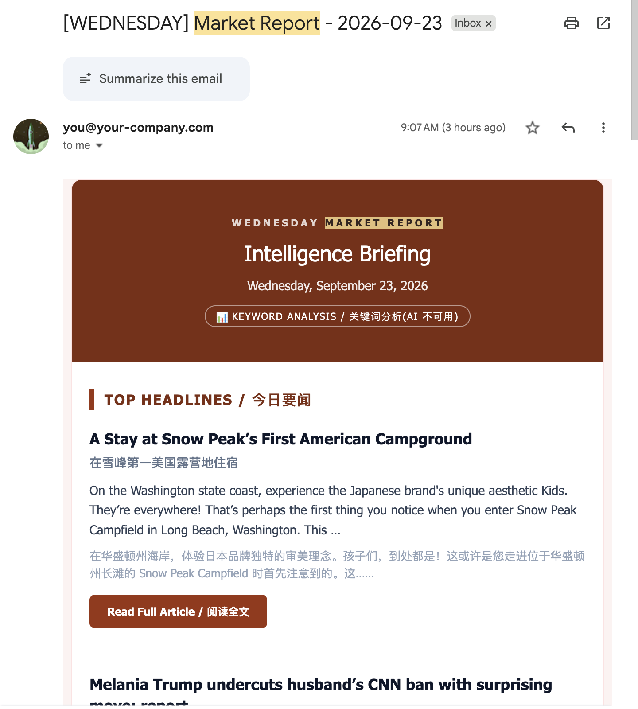
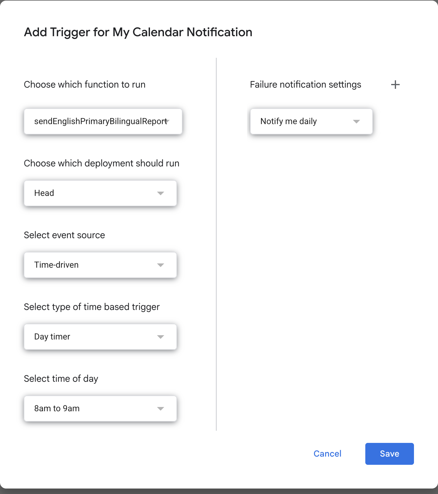

# Market digest (bundled extra)

> One email every morning: 10 global finance headlines (English original + Chinese translation) + Gemini's bullish / bearish read on Technology, Finance and Energy + a bilingual market summary. [中文](README.zh.md) · [long-form article (zh)](ARTICLE.zh.md)

File: [`news.js`](../../news.js) in the repo root, which uses two helpers from [`MM_util.js`](../../MM_util.js). No other relationship with the meeting-minutes system; works on its own.

## What you need

| Item | Where | Required |
|---|---|---|
| NewsAPI key | Free signup at [newsapi.org](https://newsapi.org) | Yes |
| Gemini API key | [Google AI Studio](https://aistudio.google.com/apikey) | No — without it the digest falls back to keyword analysis and still arrives |

## Setup (10 minutes)

1. In your Apps Script project create a file `news` and paste `news.js`; create `MM_util` and paste `MM_util.js` (already present if you installed the meeting-minutes system).
2. Project Settings → Script Properties:

   | Property | Value |
   |---|---|
   | `NEWS_API_KEY` | your NewsAPI key |
   | `GEMINI_API_KEY` | optional |
   | `RECIPIENTS` | optional, comma-separated subscriber emails. Empty = you only |

3. Function dropdown → `sendEnglishPrimaryBilingualReport` → Run → complete authorisation. The first email arrives in seconds.
4. Left sidebar clock icon "Triggers" → Add Trigger → function `sendEnglishPrimaryBilingualReport` → Time-driven → Day timer → pick an hour (e.g. 8–9 am).

## How it works

- Pulls the 100 most popular business / finance articles of the last 24 h from NewsAPI
- Filters promotional junk (three blacklists: title, body, source)
- 3-day sliding-window dedup so the same story does not repeat on consecutive days
- Sends all 100 headlines to Gemini in one call for the sector read and summary; on failure falls back to bag-of-words, and the badge at the top of the email says which one you got
- Subscribers are on BCC and cannot see each other
- Sends you a failure alert if anything breaks

## Honest caveats

- NewsAPI's free tier lags about 24 h — fine for a daily review, useless for intraday decisions
- The AI reads **headlines**, not full articles; it can be wrong and can hallucinate
- **Not investment advice**
