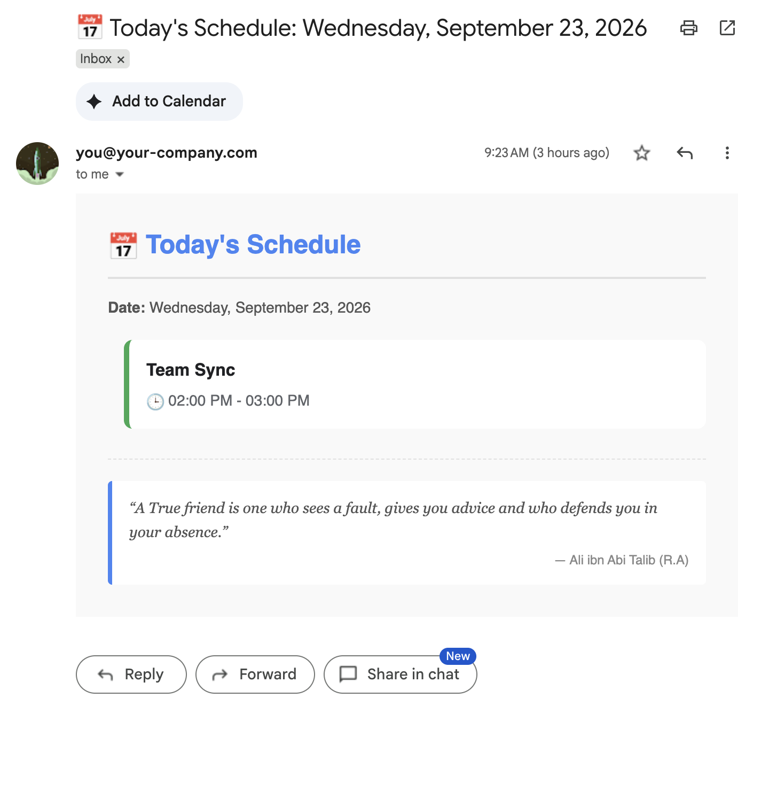
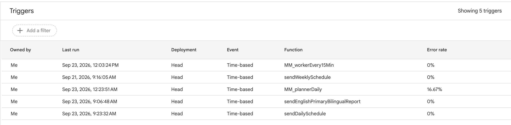

# 日程提醒（附赠工具）

> 每天早上把今天的日程、每周一把本周的日程，发一封排版好的邮件给自己，末尾附一句名言。[English](README.en.md)

文件：仓库根目录 [`schedule.js`](../../schedule.js)，依赖 [`MM_util.js`](../../MM_util.js) 的 `escapeHtml_`。零配置，没有任何 Key。

## 部署（5 分钟）

1. Apps Script 项目里新建文件 `schedule`，粘贴 `schedule.js`；新建 `MM_util`，粘贴 `MM_util.js`（装过会议纪要系统的话已经有）。
2. 函数下拉选 `sendDailySchedule` → 运行 → 完成授权（需要日历只读和发邮件权限）。
3. 「触发器」→ 添加两条：

   | 函数 | 类型 | 时间 |
   |---|---|---|
   | `sendDailySchedule` | 天定时器 | 早上 7~8 点 |
   | `sendWeeklySchedule` | 周定时器 | 周一 早上 7~8 点 |

## 说明

- 读的是你的**默认日历**；全天事件显示「All day」
- 邮件只发给你自己，没有收件人配置
- 名言来自 dummyjson.com 的随机接口，拿不到时用内置的 5 条
- 想改颜色 / 名言库 / 措辞，都在文件顶部的 `CONFIG` 里
